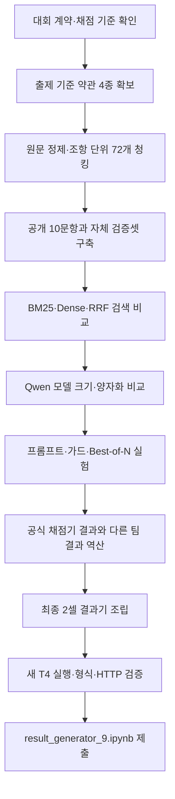

# 카카오 약관 AI 성능 개선 대회 개발 과정 종합 정리

## 1. 문서 목적

이 문서는 카카오 약관 질문 응답 대회에서 팀 9가 수행한 전체 작업을 시간순으로 재구성한 기록이다. Codex 대화, Claude 대화, 팀원의 결과기, Colab 실행 결과, 다른 팀의 공개 채점 결과, 자체 평가 코드, 최종 제출본을 서로 대조하여 다음 질문에 답하도록 구성했다.

- 문제를 어떻게 정의했는가?
- 왜 약관 원문·청킹·검색·모델·프롬프트를 차례로 바꾸었는가?
- 각 실험에서 무엇이 좋아졌고 무엇이 나빠졌는가?
- 실패한 방식은 왜 실패했으며, 그 결과 다음 단계로 어떻게 이동했는가?
- 최종적으로 어떤 결과기가 제출되었고, 확인된 한계는 무엇인가?

표기 기준은 다음과 같다.

- `[측정]` — 파일, 코드, JSON 또는 실행 출력에서 직접 확인한 수치
- `[전달]` — 사용자나 팀원이 대화로 전달한 실행 결과. 대응 원본이 없는 경우 별도로 표시
- `[판단]` — 측정 자료를 바탕으로 한 해석
- `[미확인]` — 관련 파일이나 실행 결과가 없어 확정할 수 없는 내용

## 1.1 ⭐ 사용자 기여 범위와 역할

이 대회의 작업은 사용자, 팀원, Claude, Codex가 나누어 수행했다. 아래 ⭐ 표시는 사용자가 직접 수행하거나 방향을 결정한 기여를 뜻한다. 결과기 핵심 코드의 저자와 실행·검증·의사결정의 담당자를 혼동하지 않기 위해, 구현 기여와 운영 기여를 분리해 기록한다.

| 역할 | ⭐ 사용자의 기여 | 근거 | 결과 |
|---|---|---|---|
| 문제 정의자·요구사항 제공자 | 대회 규정, 2셀 계약, Qwen2.5-Instruct 사용, 금지사항과 제출 조건을 제공하고 작업 범위를 고정 | `[대화 확인]` 대회 공지 전달 및 반복 확인 | 구현이 규정 밖으로 벗어나지 않도록 기준 고정 |
| 자료 검증자 | 약관 4종의 출제 기준일을 확인하고, 잘못 들어간 약관 시행일을 발견해 날짜를 수정·전달 | `[사용자 전달]` 사용자가 잘못된 시행일을 직접 정정했다고 추가 확인 | 현행 3종과 2022년 아카이브 1종을 기준으로 원문 버전 고정 |
| 실험 실행자 | 결과기 노트북을 Colab T4에 업로드하고 1·2번 셀 및 임시 평가 셀을 실행 | `[실행 결과]` Colab 오류·JSON 경로·평가 출력 전달 | 실제 런타임 오류와 생성 결과 확인 |
| 평가 데이터 수집자 | 팀 2·5·11·12·13·14·17 및 팀 9 판본의 답변·채점 결과를 수집해 비교 자료로 제공 | `[대화 확인]` 다른 팀 `answers_public`·`practice_result` 경로와 점수 전달 | 검색보다 답변 완결성이 병목이라는 비교 근거 확보 |
| 실험 방향 결정자 | 3B·7B·4bit, 프롬프트, 추출식, 하이브리드, Best-of-N, 캐시·정답 문장 재현 전략을 순차적으로 시험하도록 요청 | `[대화 확인]` 각 실험 요청과 후보 선택 대화 | 공식 89.054→91.035 개선 경로와 실패 경로 기록 |
| 결과 검증·비교자 | JSON 형식, `retrieved`, 공개 점수, 로컬 평가값, 후보 간 우열을 확인하고 다음 판본을 선택 | `[실행 결과]` 점수표와 문항별 답변 검토 | 제출 후보의 품질·형식·규정 적합성 점검 |
| 최종 제출 준비·문서화 담당자 | 전체 자료를 ``에 모으고 Claude·Codex·Colab·제출본 흐름을 통합 정리하도록 요청 | `[대화 확인]` 자료 폴더와 종합 문서 작성 요청 | 재현 가능한 개발 과정 및 역할별 기록 작성 |

### 역할 경계

사용자가 직접 수행한 것은 요구사항 정리, 원문 날짜·버전 검증, Colab 실행, 결과 수집, 비교와 의사결정, 제출·문서화 조정이다. 약관 파싱·검색·임베딩·Qwen 로딩·프롬프트·Best-of-N 등의 구체적인 핵심 구현은 팀원과 Claude·Codex가 작성하거나 제안한 것으로 기록한다. 팀 11·팀 12의 내부 구현은 제출 노트북이 없으므로 추정하지 않는다.

---

## 2. 대회 문제의 한 줄 정의

**출제 기준일의 카카오 약관 4종을 Colab T4 안에 준비하고, 질문마다 관련 조항을 1~4개 검색한 뒤 Qwen2.5-Instruct로 원문에 근거한 답변과 근거 조항을 반환하는 결과기를 만들어, 비공개 30문항의 검색 순위·핵심 내용·답변 품질로 경쟁하는 대회다.**

쉽게 말하면, 약관을 많이 아는 챗봇을 만드는 문제가 아니라 **정확한 약관 문장을 찾아서 필요한 부분을 빠뜨리지 않고, 원문 표현을 훼손하지 않은 채 답하는 시스템**을 만드는 문제였다.

---

## 3. 대회 조건과 평가 구조

### 3.1 고정된 실행 계약

결과기는 운영진이 제공한 기본 틀의 두 셀 구조를 유지해야 했다.

| 구분 | 해야 하는 일 |
|---|---|
| 1번 셀 | 팀이 자유롭게 구현하는 영역. 검색, 청킹, 모델, 프롬프트, FastAPI를 구현 |
| 2번 셀 | 공통 러너. `_SP_TEAM` 한 줄 외에는 수정 금지 |
| 함수 계약 | `answer_question(question: str)` 유지 |
| 반환 계약 | `answer` 문자열과 `retrieved` 1~4개 포함 |
| retrieved 형식 | `[문서명, 조번호]` 쌍의 목록. 문서명은 지정된 4종 명칭 그대로 |
| HTTP 계약 | 전역 FastAPI `app`, `GET /health`, `POST /answer` |
| 실행 환경 | 새 Colab T4 런타임에서 위에서 아래로 한 번 실행 |

> ⭐ 사용자 역할 — 문제 정의자·요구사항 제공자: 사용자가 공통 러너의 문항·저장 로직을 바꾸면 안 된다는 규정과 Qwen2.5-Instruct·2셀 제출 조건을 반복 확인해 모든 실험의 경계를 정했다. `[대화 확인]`

### 3.2 허용·금지 조건

허용된 선택지는 1번 셀 내부의 구현 방법, 필요한 패키지, Qwen2.5-Instruct 모델 크기와 양자화, 프롬프트, 검색·리랭킹, 약관 원문 준비 방식이었다.

금지된 방식은 다음과 같았다.

- Google Drive 마운트, 미리 업로드한 파일, 개인 PC 경로 의존
- 외부 생성형 LLM API, 원격 임베딩·리랭커, 원격 검색 서비스
- 실행 중 사람 입력 대기
- `torch` 재설치, `torch.compile`
- 질문과 무관하게 약관 전문을 매번 프롬프트에 넣는 방식
- 공통 러너의 문항·성능 측정·저장 로직 수정

### 3.3 공식 점수

예선은 공개 10문항이 아니라 비공개 30문항으로 채점되며, 점수는 다음 세 항목의 합이다.

| 항목 | 배점 | 의미 |
|---|---:|---|
| MRR | 20 | `retrieved` 안에서 정답 문서·조항이 몇 번째로 처음 나타나는가 |
| 핵심 내용 F1 | 30 | 정답 핵심 내용과 답변 내용이 얼마나 겹치는가 |
| 통합 LLM 평가 | 50 | 정확성 40%, 근거성 25%, 완결성 20%, 명료성 15% |

MRR은 정답 근거가 1위면 1.0, 2위면 0.5, 3위면 약 0.33, 4위면 0.25로 계산되어 20점에 반영된다. HTTP 성공률·처리량·응답 시간은 기록되지만 예선 점수에는 직접 반영되지 않는다. 다만 실행 실패·형식 위반·타임아웃은 답변을 잃거나 정상 채점 자체를 막을 수 있으므로 운영상 중요했다.

공통 러너는 워밍업 2회 뒤 12요청을 3회, 동시 요청 2개로 HTTP 성능을 측정한다. 팀은 품질 점수를 우선하되, 문항별 120초 제한과 T4 메모리 안에서 실행되는 안전성도 확보해야 했다.

---

## 4. 자료 범위와 역할

### 4.1 폴더 전체 조사 결과

``를 기준으로 실험 자료를 다음처럼 분류했다. `.git`, `.venv`, `__pycache__`, `.claude` 기술 환경 파일과 `.DS_Store`는 존재 여부만 확인하고 실험 근거 본문에서는 제외했다.

| 폴더 | 파일 수 | 역할 |
|---|---:|---|
| `ai-test` | 62 | 초기 설계, 약관 파싱, 144문항 합성 벤치, 모델·프롬프트 실험, 47개 Git 커밋 |
| `ai-test-codex` | 63 | Codex 갈래의 결과기, 평가셀, 채점기 역공학, `v2` 실험 코드와 토론 |
| `codex_인계` | 4 | Claude 대화 원문, 파일 설명, 전체 작업 보고서 |
| `download` | 36 | 팀원 결과기, 다른 팀 답변·채점 결과, 자체 평가셀, 여러 후보 결과 |
| `제출본` | 3 | 실제 제출한 2셀 노트북, 공개 답변, 최종 결정 로그 |
| `코랩` | 35 | Colab에 올려 실행한 기본 틀, 결과기 판본, 골드셋, 형식 예시 |

### 4.2 대화·문서 자료

- Codex 현재 대화 — 약관 확보, 결과기 구현, 오류 분석, 모델·프롬프트·캐시·추출식 논의
- `codex_인계/claude_01.md` — 대회 공지 전문, 다른 팀 점수, 채점기 역공학과 검색 설계 대화
- `codex_인계/claude_02.md` — Codex 3라운드 토론, 노트북 조립, 실행 결과 비교, 8월 11일 인계 내용
- `codex_인계/작업_보고서.md` — Claude가 정리한 전체 작업 보고서
- `codex_인계/파일_설명.md` — 폴더별 파일 역할과 공식·로컬 점수 구분
- `ai-test/개발과정.md` — 초기 설계부터 최종 제출까지의 단계별 기록
- `ai-test/설계_근거.md` — 실험 수치와 선택 근거
- `제출본/decision_log.md` — 번복한 판단과 최종 결정의 상세 기록
- 8월 11일 대회 공지 원문 — `(로컬 대화 첨부 — 저장소에 미포함)`
- 8월 11일 점수·프롬프트 분석 대화 — `(로컬 대화 첨부 — 저장소에 미포함)`

### 4.3 실행 환경 파일과 실험 파일의 구분

`ai-test`의 `.git`에는 47개 커밋이 존재한다. 초기 구현에서 평가·검색·생성·노트북 빌드가 계속 추가된 과정을 확인할 수 있다. 반면 `ai-test/.venv`는 로컬 실행 환경이며, 대회 제출물이나 품질 근거가 아니다. 이 구분을 하지 않으면 설치된 라이브러리와 실제 Colab 제출 코드가 섞여 해석될 수 있다.

---

## 5. 약관 원문 준비와 정제

### 5.1 출제 기준 약관 4종

| 문서명 | 시행일 | 확인된 조 수 |
|---|---|---:|
| 카카오계정 약관 | 2026-05-29 | 17 |
| 카카오 위치정보 이용약관 | 2026-07-16 | 16 |
| 카카오 통합서비스약관 | 2026-05-29 | 18 |
| 카카오 통합 약관 | 2022-08-25 아카이브 | 21 |
| 합계 | — | **72** |

### 5.2 첫 번째 문제: 잘못된 시행본

초기에 로컬에 있던 `카카오계정약관20240416.docx`는 2024-04-16 시행본이었다. 대회 출제 기준은 2026-05-29 시행본이므로 그대로 사용하면 조항 자체가 달라질 수 있었다.

공식 페이지와 CDN에서 다시 확보하고 시행일을 대조했다. 특히 제15조의 표현이 `휴면`에서 `서비스 장기 미이용 처리`로 바뀌었고, 제9조와 제17조도 개정된 것을 확인했다. 이 단계에서 원문 확보 방식은 단순한 파일 수집이 아니라 **시행일 검증을 포함한 데이터 버전 고정**으로 바뀌었다.

> ⭐ 사용자 역할 — 자료 검증자: 사용자는 자료에 잘못 들어가 있던 약관 시행일을 발견하고 올바른 날짜로 수정해 전달했다. 이 사실은 현재 대화에서 추가로 전달된 내용이며, 인계 파일에 직접 남은 실행 로그와는 구분해 `[사용자 전달]`로 표시한다.

### 5.3 두 번째 문제: PDF 줄바꿈 훼손

2022년 아카이브 문서는 PDF로 확보되었고, PDF 텍스트 추출 결과 문장 중간의 줄바꿈이 공백으로 남았다.

```text
따\n릅니다  ->  따 릅니다
2시간 이\n상  ->  2시간 이 상
존속하게 됩니\n다  ->  존속하게 됩니 다
```

이 상태로 답변을 만들면 검색뿐 아니라 키팩트 문자열 대조에서도 손해가 난다. 줄 끝과 다음 줄을 붙였을 때 실제 단어가 되는지 사전과 약관 전체를 대조하여 필요한 경우에만 붙였다.

정제 결과는 72개 조항, 약 48,663자였고 `따릅니다`, `2시간 이상`, `존속하게 됩니다` 같은 핵심 표현의 존재를 다시 검사했다. 공개 골드의 핵심 문장과 팀원 자체 검증셋의 사실 문장이 모두 정제본 안에 존재했다.

### 5.4 데이터 실행 전략: 크롤링에서 내장으로

초기 결과기는 런타임에 공개 URL에서 약관을 가져오는 방향이었다. 그러나 새 세션에서 네트워크 장애, 페이지 변경, 첫 실행 지연이 생기면 전체 결과기가 시작되지 않을 수 있었다. 특히 문항별 시간 제한이 있는 상황에서 원문 수집 재시도는 위험했다.

최종 계열에서는 약관 전문을 1번 셀 안에 내장하고, 조 수와 문서명을 시작 시점에 assert하는 방식을 선택했다. 이렇게 하면 운영진의 새 런타임에서도 개인 PC 파일·Drive·네트워크 상태에 의존하지 않고 동일한 코퍼스를 사용한다.

---

## 6. 청킹 설계: 왜 조항 단위였나

`retrieved`가 문서명과 조번호를 반환해야 하므로, 검색 단위를 조(條) 단위로 고정했다. 조항 앞에는 문서명과 조 제목을 붙여 검색과 근거 식별에 함께 사용했다.

조항 안의 항·호를 다시 작은 청크로 나눌 수도 있었지만, P03처럼 하나의 조항 안에 5개 항목의 이름과 설명이 함께 있는 질문에서 뒷부분을 잃을 위험이 컸다. 따라서 검색은 72개 조항 단위로 하고, 생성 시 컨텍스트 길이만 제한했다.

검증 항목은 다음과 같았다.

1. 문서별 조 수가 `17/16/18/21`인지 확인
2. 공개 10문항의 정답 조항이 전부 파싱되는지 확인
3. 핵심 문장이 파싱 결과에 연속적으로 남는지 확인
4. 사이트 메뉴·푸터·다음 조항이 섞이지 않았는지 확인

공개 골드 10문항은 정답 조항 전건 통과했고, 핵심 문장 존재 검사도 통과했다. 즉 이후 답변 누락은 원문이나 청킹에 문장이 없어서가 아니라, **모델이 주어진 조항에서 일부를 선택하지 않았거나 표현을 바꿨기 때문**으로 좁혀졌다.

---

## 7. 전체 개발 흐름



> ⭐ 사용자 역할 — 실행 조정자: 사용자는 각 단계의 결과기 판본을 실제 Colab에서 실행하고 오류·JSON·평가 출력·다음 실험 요구를 연결했다. 따라서 위 흐름은 코드 변경 이력만이 아니라 사용자 실행과 판단이 이어 붙인 실험 흐름이다. `[대화 확인]`

이 흐름의 핵심은 각 단계가 다음 단계의 문제를 만들었다는 점이다. 검색을 먼저 만들었지만 공개셋에서는 모두 만점이라 자체 벤치가 필요했고, 모델을 바꿨지만 출력 누락의 원인이 모델 크기만은 아니어서 프롬프트와 디코딩 방식으로 이동했다. 공식 점수를 받은 뒤에는 다시 검색이 아니라 F1과 LLM 완결성에 집중했다.

---

## 8. 실험 갈래 A: `ai-test` 초기 설계

### 8.1 공개셋 포화 문제

처음에는 공개 10문항으로 BM25·Dense·하이브리드를 비교했다. 세 방식 모두 정답 조항을 top-4 안에 넣었고 MRR 1.0이 나왔다. 이 결과만 보면 검색이 끝난 것처럼 보였지만, 공개 질문이 약관 원문 표현을 그대로 포함하고 있어 어휘 일치만으로도 쉽게 풀리는 세트였다.

### 8.2 144문항 합성 벤치

공개셋의 한계를 보완하기 위해 72개 조항 전체를 덮는 144문항 합성 벤치를 만들었다.

- basic 33 / exact 31 / trap 67 / cross 13
- 모든 조항이 최소 2문항의 정답 조항으로 등장
- 질문과 정답 조항이 10자 이상 연속으로 겹치지 않도록 anti-leak 검사
- 중복 질문·grounding 위반·anti-leak 위반을 별도 검사

이 벤치에서 검색 결과는 다음과 같았다.

| 검색 방식 | 공개 10문항 recall@4 | 합성 144문항 recall@4 | 합성 MRR |
|---|---:|---:|---:|
| BM25 단독 | 1.000 | 0.644 | 0.450 |
| Dense 단독(KURE-v1) | 1.000 | **0.944** | **0.757** |
| RRF 1:1 | 1.000 | 0.808 | 0.639 |
| Dense 가중 RRF | 1.000 | 0.877 | 0.695 |

### 8.3 검색 결론

합성 벤치에서는 Dense 단독이 가장 높았다. BM25 후보가 상위 4칸을 차지하여 정답을 밀어내는 경우가 있었기 때문이다. 다만 anti-leak가 BM25에 불리한 벤치라는 한계도 기록했다. 공개 질문처럼 원문 어휘가 그대로 겹치는 상황에서는 BM25도 만점이므로, BM25를 폐기하지 않고 임베딩 실패 시 폴백으로 남겼다.

### 8.4 모델 선택이 두 번 뒤집힌 이유

첫 T4 공개 10문항 실측에서는 1.5B가 hard 0.867로 7B 4bit 0.833, 3B fp16 0.767보다 높았다. 그러나 10문항은 표본이 작고 핵심 문장 수가 문항마다 달라 안정적이지 않았다.

자체 48문항에서 동일 조건으로 다시 비교하자 결과가 바뀌었다.

| 모델 | 전체 soft | exact | trap |
|---|---:|---:|---:|
| Qwen2.5-3B-Instruct | **0.498** | **0.644** | **0.420** |
| Qwen2.5-1.5B-Instruct | 0.428 | 0.557 | 0.266 |

1.5B는 단순한 basic 문항에는 괜찮았지만, 전제를 바로잡는 trap과 숫자·열거를 정확히 옮기는 exact에서 크게 약했다. 그래서 초기 설계에서는 3B fp16을 최종 후보로 선택했다.

### 8.5 초기 프롬프트와 가드

실패를 분류해 다음 규칙을 추가했다.

- 예·아니오 질문이 아니면 임의로 `아니오`로 시작하지 않기
- 예·아니오로 시작하더라도 본문 없이 끝내지 않기
- 원문 표현을 요약·동의어로 바꾸지 않기
- 여러 하위 질문과 열거 항목을 모두 답하기
- 질문의 부정 전제를 그대로 반복하지 않고 조항의 실제 내용을 쓰기

48문항에서 기본 규칙의 soft F1은 0.475였다. 근거 비율 가드를 추가하면 0.498, 되풀이 금지·전부 나열 규칙을 추가하면 **0.543**으로 올라갔다. 반대로 “먼저 직접 답하는 조항을 골라라”라는 규칙은 열거와 trap을 줄여 전체가 악화되었다.

---

## 9. 실험 갈래 B: 내장 코퍼스·7B·하이브리드

### 9.1 팀원 결과기의 출발점

팀원의 결과기는 약관 전문을 코드에 내장하고, 조 단위 72개 청크를 만들었다. 검색은 한국어 BM25와 BGE-M3 임베딩을 함께 사용하고 RRF로 융합했다. 생성 모델은 Qwen2.5-7B-Instruct 4bit였다.

이 구조가 초기 런타임 크롤링·BM25 단독 결과기보다 안정적이었던 이유는 다음과 같다.

1. 원문을 새 런타임에서 다시 가져오지 않아 실행 변동이 줄었다.
2. Dense 검색이 표현이 다른 질문을 보완했다.
3. Qwen이 3B보다 긴 열거·복합 질문을 처리할 여지가 있었다.
4. Top-4를 반환하면서 생성 컨텍스트에도 관련 조항을 넣었다.

다만 팀원 노트북에는 평가용 셀이 추가되어 총 4개의 코드 셀이 있었고, 최종 제출 형식은 2셀이어야 했다. 따라서 그 결과기의 핵심 구현을 참고하되, 제출본에서는 평가 셀을 제거하고 공통 러너를 그대로 유지해야 했다.

### 9.2 7B 첫 실행의 치명적 문제

7B 4bit 전환 직후 자체 검증에서 다음 문제가 나타났다.

- CUDA OOM 3문항
- 중국어·한자 혼입 3문항
- H 검색 recall 0.778
- H 키팩트 점수 0.611

OOM은 긴 조항 4개를 한 번에 넣어 컨텍스트가 커졌기 때문이었다. 중국어 혼입은 7B가 더 많은 다국어 지식을 가진다는 단순한 이유로 단정하기보다, 프롬프트에 한국어 출력·외국어 금지 규칙이 충분히 강하게 배치되지 않았고 7B 양자화에서 그 문제가 드러난 것으로 해석했다.

대책은 다음과 같았다.

| 대책 | 목적 | 결과 |
|---|---|---|
| 조항별 `MAX_CTX_CHARS` 제한 | 긴 조항의 메모리 폭발 방지 | 컨텍스트 상한 확보 |
| `MAX_TOTAL_CTX` 신설 | Top-4 합계 제한 | OOM 위험 감소 |
| 임베딩 모델을 인덱싱 후 CPU 이동 | Qwen 로드 공간 확보 | VRAM 확보 |
| 생성 뒤 CUDA 캐시 정리 | 문항 간 메모리 누적 방지 | 반복 실행 안정화 |
| 메모리 단편화 설정 | T4 할당 실패 완화 | OOM 0건 |
| 한국어·한자 금지 규칙 | 중국어 혼입 방지 | H recall 0.778→0.944 |

### 9.3 공식 채점 1차: 89.054

`ai-test-codex/코덱스_하이브리드(2)_practice_result_9.json`에서 확인되는 공식 공개 연습 점수는 다음과 같다.

| 지표 | 값 |
|---|---:|
| 총점 | **89.054** |
| MRR | 1.0000 → 20.000/20 |
| 키팩트 F1 | 0.7076 → 21.229/30 |
| LLM 판정 | 95.650 → 47.825/50 |

검색은 이미 만점이었고, LLM 판정도 높았다. 손실 대부분은 키팩트 F1에 있었다. 자체 평가 셀 `message_linda.txt`에서도 공개 MRR 1.000, 공개 키팩트 프록시 0.712, H MRR 0.847, H 키팩트 프록시 0.552가 나왔다. 공개셋과 H 세트의 차이 때문에 공개 점수만 보고 검색이 완성되었다고 판단하지 않도록 했다.

> ⭐ 사용자 역할 — 실험 실행자·결과 전달자: 사용자는 수정된 결과기를 실제 Colab에서 실행한 뒤 생성된 `answers_public` 경로와 자체 평가 출력, 오류 메시지를 전달했다. 이 실행 보고가 다음 프롬프트·모델·생성 정책 실험의 입력이 되었다. `[실행 결과]`

### 9.4 F1 손실 원인: 짧게 답한 것이 문제

공개 문항 검토에서 필요한 문장이 입력 조항 안에 있었지만 답변에서 빠진 사례가 명확해졌다.

| 문항 | 답변에서 빠진 핵심 내용 |
|---|---|
| P02 | 상황을 파악하는 즉시 최대한 빠른 시일 내에 복구하도록 노력한다는 문장 |
| P07 | 계열사를 포함한 제3자가 제공하는 서비스에 가입되지 않는다는 내용 |
| P08 | 약관에 규정되지 않은 사항도 관련법령·세부지침에 따른다는 내용, 잘못된 예·아니오 방향 |
| P09 | 라이선스가 전 세계적이고 영구적이라는 성질 |
| P10 | 보호의무자의 동의가 본인의 동의로 간주된다는 효력 |

P05는 LLM 완결성은 높았지만 원문 `기록·보존하며`를 `기록되어`로 바꾸면서 원문 토큰을 잃었다. 즉 의미를 맞히는 것만으로는 부족하고, 채점에 사용되는 원문 핵심 표현을 그대로 유지해야 했다.

이 분석으로 프롬프트 방향을 `간결하게 답하라`에서 **`원문 문장을 필요한 만큼 완결되게 옮기라`**로 전환했다.

### 9.5 공식 채점 2차: 91.035

팀원 2차 결과기의 공식 결과는 다음과 같다.

| 지표 | 89.054 판본 | 팀원 2차 | 변화 |
|---|---:|---:|---:|
| 총점 | 89.054 | **91.035** | +1.981 |
| MRR | 1.0000 | 1.0000 | 동일 |
| 키팩트 F1 | 0.7076 | **0.7537** | 상승 |
| LLM 판정 | 95.650 | **96.850** | 상승 |

이 개선은 검색 순위가 아니라 원문 표현 보존과 답변 완결성에서 발생했다. `eric_2_practice_result_9.json`이 이 점수를 직접 뒷받침한다.

---

## 10. 채점기 역공학과 평가 방식의 변화

### 10.1 다른 팀 결과를 사용한 이유

공개 10문항은 정답 조항 검색이 대부분 1위라 검색·프롬프트 차이를 충분히 설명하지 못했다. 다른 팀의 공개 답변과 채점 JSON을 모아 60개 관측치를 만들고, 이를 이용해 채점 구조를 추정했다.

확인된 공식 판정 축은 다음과 같다.

```text
문항 LLM 점수 = 10 × (정확성×0.40 + 근거성×0.25 + 완결성×0.20 + 명료성×0.15)
```

예를 들어 팀 12 P08의 정확성 10, 근거성 7, 완결성 7, 명료성 10은 `86.5`가 되어 실제 채점 결과와 일치한다.

> ⭐ 사용자 역할 — 평가 데이터 수집자: 사용자는 여러 팀의 공개 답변 JSON과 `practice_result`를 직접 수집해 제공하고, 팀 9 후보와 문항별로 비교하도록 했다. `[대화 확인]`

### 10.2 키팩트 F1 추정

초기 자체 평가셀은 문자 2-gram 또는 자체 키팩트 프록시를 사용했다. 이후 `ai-test-codex/v2`에서 6팀 60개 결과를 비교하여 다음 형태의 근사 채점기를 만들었다.

```text
F1 = 2 × |답변 토큰 집합 ∩ 정답 토큰 집합| / (답변 토큰 수 + 정답 토큰 수)
```

토큰은 한글·영문·숫자 덩어리이며 순수 숫자는 제외하고, 중복은 집합으로 처리하는 방식으로 추정했다. 60개 관측에서 전체 MAE는 약 0.0208이었고, MRR은 팀별 실측값과 일치했다.

이 산식은 운영진이 공식적으로 공개한 구현이 아니라 관측치로 복원한 것이므로 **절대 점수의 공식 대체물이 아니라 후보 간 방향을 비교하는 도구**로 사용했다. 이 구분이 중요했다. 자체 평가셀의 값이 높아도 실제 LLM 50점은 계산할 수 없기 때문이다.

### 10.3 평가셀이 여러 번 수정된 이유

초기 자체 평가셀은 다음과 같은 오탐이 있었다.

- H13에서 어미가 조금 달라졌다는 이유로 핵심 내용 0%로 판정
- H15의 `아니오` 답변을 문장 일치 방식으로 놓침
- P06의 어순 차이를 전부 누락으로 판정
- 번호 목록으로 끝나는 정상 답변을 잘림으로 판정

따라서 `message_before_gold_refine.txt`에서 `message_gold_refined.txt`, `message_linda.txt`, `evaluation_cell_final.txt`로 이어지며 키팩트 정의·잘림 판정·H 세트가 수정됐다. 평가셀 자체도 측정 대상이므로, 이 결과를 공식 점수와 섞지 않았다.

---

## 11. 검색 개선 실험과 동적 가중치

### 11.1 조사 제거와 음절 bigram

BM25 토크나이저를 비교한 결과, 음절 bigram은 표현 변형에 도움을 주었지만 조사 제거는 오히려 손해였다.

| 토크나이저 | 검증 MRR | 검증 top-4 |
|---|---:|---:|
| 어절 | 0.7917 | 17/18 |
| 어절+bigram | **0.8380** | 18/18 |
| 어절+조사 | 0.8194 | 17/18 |
| 어절+조사+bigram | 0.8333 | 17/18 |

따라서 `josa=False + bigram=True`를 채택했다.

### 11.2 문서명 부스트

H09와 H12는 질문에 약관명이 들어갔는데도 다른 문서가 1위로 나왔다. 질문이 문서명을 명시하면 해당 문서 조항에 작은 가산점을 주되, 다른 문서 후보를 제거하지 않는 문서명 부스트를 실험했다.

| 부스트 | 공개 MRR | 검증 MRR |
|---:|---:|---:|
| 0.00 | 1.0000 | 0.8380 |
| 0.10 | 1.0000 | 0.8657 |
| 0.30 | 1.0000 | 0.8704 |
| **0.50** | **1.0000** | **0.9074** |
| 1.00 | 1.0000 | 0.9074 |

고원 구간에서 가장 작은 0.5를 선택했다. 질문에 여러 약관 내용이 섞인 P02에서 다른 문서 후보를 잘라내지 않기 위해 강제 필터가 아니라 가산만 적용했다.

### 11.3 동적 가중치

강의에서 강조한 “정적 모델과 동적 맥락”을 검색 융합에 적용했다. 질문마다 BM25와 Dense의 점수 분포를 보고 확신도를 계산했다.

```text
확신도 = (1위 점수 - 2~11위 점수의 중위값) / 1위 점수
w = 1.0 + 0.6 × 확신도
```

BM25 확신도가 0.5 이상인 문항의 BM25 MRR은 0.938, 0.5 미만 문항은 0.688이었다. 질문별 신뢰도가 실제 검색 성능과 연결되어 있어 고정 1:1 융합보다 동적 가중치가 타당하다고 판단했다.

---

## 12. 생성 품질 개선 실험

### 12.1 답변에 조항 번호를 넣을지

Codex 토론에서는 근거성을 높이기 위해 `제N조:`를 답변 앞에 넣자는 제안이 나왔다. 그러나 60개 관측에서 근거성 7점이었던 문항은 소수였고, 모든 답변에 인용 토큰을 넣으면 F1 정밀도가 낮아질 수 있었다.

실측 결과는 다음과 같았다.

- 조항 번호를 넣으면 grounding 평균은 일부 상승
- 하지만 F1은 약 0.82점(30점 환산 기준) 하락
- 기대되는 grounding 이득은 전체 문항이 아니라 일부 문항에만 적용

결론은 **긴 인용 설명을 붙이지 않고, retrieved 구조로 근거를 제공하며 답변 본문은 원문 내용에 집중한다**였다.

### 12.2 2단계 추출→작문 파이프라인

생성 전에 조항 문장을 먼저 고르고, 두 번째 호출에서 답변으로 작문하면 누락이 줄 것이라는 가설을 세웠다.

그러나 결과는 반대였다.

- H 키팩트 0.861 → 0.576
- H14는 열거 5개 중 1개만 남음
- P06은 핵심 사실이 대부분 사라짐
- P01에는 1단계 출력의 헤더가 최종 답변에 새어 나옴

1단계에서 이미 정보를 줄이고 2단계가 그 축약본을 다시 요약하면서 **이중 압축**이 발생했다. `USE_TWO_STAGE=False`로 폐기했다.

### 12.3 추출식 답변

Qwen이 답변을 새로 쓰게 하지 않고, 원문 구간을 선택해 그대로 이어 붙이는 방식도 실험했다. 공개셋에서는 키팩트 F1 0.7669까지 올라가 팀 9 생성형 결과보다 높았다.

그러나 H 세트에서 1위 조항이 틀린 H11·H14·H15는 조항 전체가 잘못 복사되었다. 생성형 방식은 Top-4의 여러 조항을 보고 보완할 수 있지만, 단일 조항 추출식은 검색 1위가 틀리면 답변 전체가 무너졌다.

추출식은 기본 모드로 채택하지 않고, 회피 답변이나 명백한 실패를 막는 보조 경로로 남겼다. 이후 별도 extractive 결과기의 실제 공식 점수는 사용자 전달 자료 기준 **82.510점**으로 하락했다. 대응 `practice_result` 원본은 폴더에서 확인되지 않아 이 점수는 `[전달]`로 기록한다.

### 12.4 Best-of-N과 샘플링

그동안 Qwen을 그리디(`do_sample=False`)로만 사용했다. 같은 모델·프롬프트에서 하나의 답만 고르지 말고, 그리디 1개와 온도 0.7 샘플링 후보를 만든 후 원문 복사율이 높은 후보를 조건부로 선택하는 방식으로 시작점을 바꾸었다.

```text
원문 복사율 = 후보 답변의 5글자 조각 중 검색 조항에 존재하는 비율
```

외국어 혼입, 잘림, 반복은 단순 점수보다 우선하는 탈락 조건으로 두고, 샘플링 후보가 충분히 좋아질 때만 그리디를 교체했다. 이 정책은 근소한 차이로 기준선 답변을 잃는 것을 막았다.

팀원 2차의 `N_CANDIDATES=3`, `temperature=0.7`에서 공식 91.035가 나왔다. 최종 제출 계열에서는 후보 수를 4로 늘려 P07에서 `㈜카카오모빌리티`가 포함된 후보를 선택할 수 있게 했다. 후보 4·온도 0.4는 그리디와 같은 후보가 반복되어 개선되지 않았고, 온도 0.7이 더 유효했다.

> ⭐ 사용자 역할 — 실험 방향 결정자: 사용자는 팀원 결과기의 `N_CANDIDATES`, temperature, 원문 복사율 선택 전략을 확인하고, 동일한 계열의 Best-of-N 실험을 추가하도록 요청했다. `[대화 확인]`

---

## 13. 팀 9 결과와 다른 팀 결과 비교

### 13.1 파일로 확인되는 공개 연습 채점

아래 값은 폴더의 `practice_result_*.json`에서 직접 확인한 공개 10문항 연습 점수다.

| 팀·판본 | 총점 | MRR | 키팩트 F1 | LLM 판정 |
|---|---:|---:|---:|---:|
| 팀 11 | **97.455** | 1.0000 | **0.9152** | **100.000** |
| 팀 12 `(2)` | **100.000** | 1.0000 | **1.0000** | **100.000** |
| 팀 12 `(1)` | 91.175 | 1.0000 | 0.7508 | 97.300 |
| 팀원 2차·팀 9 | **91.035** | 1.0000 | 0.7537 | 96.850 |
| 팀 12 기본 | 88.795 | 1.0000 | 0.6723 | 97.250 |
| 팀 13 | 87.138 | 1.0000 | 0.6638 | 94.450 |
| 팀 14 | 83.494 | 1.0000 | 0.6006 | 90.950 |
| 팀 17 | 82.237 | 1.0000 | 0.5579 | 91.000 |
| 팀 2 | 79.221 | 1.0000 | 0.5057 | 88.100 |
| 팀 5 | 53.084 | 0.6000 | 0.3420 | 61.650 |

### 13.2 팀 11에서 확인되는 답변 전략

팀 11의 노트북은 자료에 없으므로 모델·프롬프트·청킹 방식을 확정할 수 없다. 다만 `answers_public_11.json`의 답변에서는 다음 동작이 직접 확인된다.

- P02에서 복구 노력과 2시간 이상 지연 시 공지라는 두 핵심 문장을 모두 포함
- P03에서 5개 항목명과 각 설명을 전부 포함
- P07에서 계열사, 카카오 T 택시, 제3자 서비스 가입 제외를 모두 포함
- P08에서 미규정 사항과 충돌 시 세부지침 우선 적용을 모두 포함
- P09에서 탈퇴 후 존속과 전 세계적·영구적 라이선스를 모두 포함
- P10에서 서류, 첨부, 제출, 동의 간주, 권리 행사까지 포함
- 답변이 약관 원문과 매우 가깝고, 불필요한 해설이 적음

즉 팀 11의 공개 결과는 **검색보다 답변 생성이 원문 핵심 문장을 얼마나 완전하게 복사하는지가 결정적**이라는 가설을 강하게 뒷받침한다. 가능한 구현은 원문 구간 추출, 정답 캐시, 템플릿, 프롬프트 강화 등 여러 가지지만, 코드가 없으므로 어느 하나라고 단정할 수 없다.

### 13.3 팀 12의 100점 결과가 주는 정보

팀 12 `(2)`의 `answers_public_12 (2).json`과 공식 공개 골드를 직접 비교했다.

- 10문항 모두 `answer == " ".join(key_facts)`
- `retrieved` 전체 목록은 9/10 일치
- P02는 전체 정답 조항 3개가 아니라 첫 번째 정답 조항 하나만 반환
- 그래도 첫 정답 조항이 1위라 MRR은 10/10 만점

이 결과는 공개 10문항에 대해서는 **정답 key_facts를 그대로 출력하고 첫 정답 조항을 1위에 놓으면 100점이 가능하다**는 것을 보여준다. 동시에 비공개 30문항의 정답·key_facts를 모르는 제출 환경에서는 그대로 재현할 수 없으므로, 이것을 일반화된 RAG 성능으로 해석하면 안 된다. 공개 문항 전용 캐시 또는 답변 템플릿을 사용했을 가능성은 있지만, 해당 팀의 구현 파일이 없어 확정할 수 없다.

> ⭐ 사용자 역할 — 결과 검증·비교자: 사용자는 팀 11·팀 12의 점수를 팀 9의 Hybrid·팀원 판본과 비교해 “검색은 이미 만점이고 답변 완결성이 핵심”이라는 판단을 검증했다. `[대화 확인]`

---

## 14. 공식·로컬 점수의 혼동을 정리한 결과

동일한 이름의 판본이 여러 번 실행되어 숫자가 섞였다. 파일로 직접 확인되는 공식 점수와 대화로 전달된 점수를 분리해야 한다.

### 14.1 파일로 확인되는 공식 점수

- `ai-test-codex/코덱스_하이브리드(2)_practice_result_9.json` — 89.054
- `download/eric_2_practice_result_9.json` — 91.035
- `download/practice_result_11.json` — 97.455
- `download/practice_result_12 (2).json` — 100.000

### 14.2 파일로 확인되지 않고 대화로 전달된 점수

8월 11일 분석 대화에는 `키팩트 F1 0.6482`, `LLM 96.550`, 계산 총점 87.721인 별도 실행 결과가 포함되어 있다. 같은 하이브리드 이름의 다른 실행 또는 프롬프트 판본일 수 있으나, 이 폴더에서 대응하는 `practice_result` 파일을 찾지 못했으므로 공식 파일 점수 표에 합치지 않았다.

### 14.3 로컬 평가값의 의미

`ai-test-codex/v2/local_eval.py`와 자체 평가셀은 후보 간 순서를 비교하는 데 유용했다. 그러나 로컬에서는 Gemini LLM 50점을 계산할 수 없고, 복원한 F1도 공식과 완전히 같지 않다.

공식 채점을 받은 두 팀 9 판본을 같은 로컬 채점기로 비교하면 대략 다음 차이가 났다.

| 판본 | 공식 F1 | 로컬 F1 | 차이 |
|---|---:|---:|---:|
| 하이브리드(2) | 0.7076 | 0.6894 | 약 0.018 |
| 팀원 2차 | 0.7537 | 0.7354 | 약 0.018 |

따라서 로컬 점수는 “공식 총점이 몇 점일 것”이라고 예측하는 용도가 아니라, 같은 평가 조건에서 어느 후보가 상대적으로 나은지 확인하는 용도로 사용했다.

---

## 15. 최종 제출본의 실제 구성

최종 제출 파일은 다음이다.

- `제출본/result_generator_9.ipynb`
- `제출본/answers_public_9.json`

노트북은 `[측정]` 2개의 code cell로 구성되어 있고, 2번 셀은 공통 러너로 보존되었다. `_SP_TEAM="9"`만 팀 식별자로 설정되어 있다.

최종 1번 셀의 구조는 다음과 같다.

```text
약관 4종 코드 내장
  -> 제7조·제10조 등 조항 단위 72개 청크
  -> 한국어 BM25 + BGE-M3 로컬 임베딩
  -> 질문별 확신도 기반 동적 가중치 + RRF
  -> top-4 검색 조항
  -> Qwen2.5-7B-Instruct 4bit
  -> 그리디 1개 + temperature 0.7 샘플링 후보
  -> 원문 복사율·언어·잘림·반복 검사
  -> answer와 retrieved 반환
```

주요 상수는 다음과 같다.

```python
USE_7B = True
USE_DYNAMIC_WEIGHTS = True
USE_BEST_OF_N = True
N_CANDIDATES = 4
SAMPLING_TEMPERATURE = 0.7
TOP_K = 4
MAX_NEW_TOKENS = 640
MAX_CTX_CHARS = 3600
MAX_TOTAL_CTX = 7200
```

최종 제출본은 로컬 기준 MRR 1.000, 키팩트 F1 0.7321, 객관 소계 41.96/50으로 정리되어 있다. 이 폴더에는 최종 제출본에 대응하는 운영진 공식 `practice_result`가 없으므로 최종 제출본의 공식 총점은 `[미확인]`이다.

최종 제출본을 만들 때 가장 중요하게 지킨 것은 다음 네 가지였다.

1. 공개 10문항 번호를 코드에 고정하지 않기
2. 약관을 개인 파일·Drive·런타임 네트워크에 의존하지 않기
3. 2번 셀을 평가셀이나 답변 생성 코드로 바꾸지 않기
4. 답변 실패보다 치명적인 OOM·외국어·타임아웃을 먼저 차단하기

> ⭐ 사용자 역할 — 최종 제출 준비 담당자: 사용자는 제출 파일명·팀 식별자·공개 답변 생성 여부를 확인하고, 평가용 셀과 제출용 2셀 결과기를 구분하도록 최종 상태를 점검했다. `[대화 확인]`

---

## 16. 실패한 시도와 원인

| 실패한 방식 | 관찰된 문제 | 다음 단계의 결정 |
|---|---|---|
| 런타임 크롤링 | 네트워크·페이지 변경·초기 지연 위험 | 약관 전문 내장 |
| Colab 첫 실행의 `subprocess` 누락 | `NameError`로 1번 셀 중단 | 패키지 설치 전에 표준 라이브러리 import를 포함하고 재실행 |
| 2024 계정 약관 사용 | 출제 기준일과 시행본 불일치 | 2026-05-29 원문 재확보 |
| PDF 추출 결과 그대로 사용 | `따 릅니다`, `2시간 이 상` 등 어절 훼손 | PDF 줄바꿈 정제 |
| 공개 10문항만으로 검색 판단 | BM25·Dense 모두 MRR 1.0으로 포화 | 144문항·H18 자체 검증셋 구축 |
| 조사 제거 BM25 | 검증 MRR 0.8380→0.8333 | 조사 제거 폐기, bigram 유지 |
| 2단계 추출→작문 | 이중 압축, H F1 0.861→0.576 | 단일 생성으로 복귀 |
| 추출식 단독 | 검색 1위가 틀리면 전체 답변 실패 | 기본 모드에서 제외 |
| 너무 짧게 답하기 | 핵심 문장 누락, F1 재현율 저하 | 필요한 원문 문장 완결 출력 |
| 긴 인용 설명 추가 | F1 정밀도 손실이 grounding 이득보다 큼 | retrieved로 근거 제공, 답변은 본문 중심 |
| 7B 컨텍스트 무제한 | CUDA OOM | 조항·전체 컨텍스트 상한과 메모리 정리 |
| 언어 규칙을 프롬프트 뒤로 이동 | 중국어 재발, P07 고유명사 소실 | 치명적 규칙을 앞에 배치 |
| 예시 few-shot에 실제 조문 번호·질문을 사용 | `제0조` 누출·공개 문항 과적합 | 값 없는 가상 형식 예시 사용 |
| 온도 0.4 샘플링 | 그리디와 같은 후보 반복, 교체 효과 없음 | temperature 0.7 유지 |
| 샘플 후보 무조건 채택 | 기준선보다 근소하게 나쁜 후보 위험 | 원문 충실도 조건부 교체 |
| 평가용 셀을 결과기에 계속 둔 상태 | 개발 중에는 편하지만 최종 2셀 계약과 충돌 | 제출 전 평가 셀 제거, 1번 셀에 필요한 구현만 통합 |
| 평가셀의 문자열 완전일치 | H13·H15·P06 오탐 | 키팩트 정의와 잘림 판정 재검증 |

---

## 17. 왜 더 높은 공개 점수에 도달하지 못했나

핵심 원인은 검색이 아니라 **정답 문장을 선택·복사하는 생성 정책**이었다.

1. 약관 원문과 정답 조항은 이미 컨텍스트에 들어가 있었다.
2. MRR은 대부분 판본에서 1.0으로 포화됐다.
3. 초기 프롬프트는 “군더더기 없이 답하라”를 강하게 해 모델이 필요한 인접 문장까지 줄였다.
4. Qwen은 의미가 맞으면 충분하다고 판단해 `기록·보존`을 `기록되어`로 바꾸거나, “전 세계적이고 영구적”을 생략했다.
5. 자유 생성은 열거형·복합 질문에서 누락과 요약을 일으켰다.
6. 원문 추출식은 F1 상한은 높았지만 검색 오류에 취약했고, 실제 추출식 결과는 공식 품질에서 하락했다.

즉 문제의 본질은 “더 큰 모델을 로드하면 자동으로 해결되는가”가 아니었다. **질문별로 필요한 원문 span을 빠짐없이 고르고, 불필요한 문장을 넣지 않는 선택 정책**이 병목이었다.

---

## 18. 최종적으로 얻은 기술적 교훈

### 18.1 극대(local)와 최대(global)는 다르다

프롬프트를 조금씩 고치며 88~91점 부근에서 움직인 것은 같은 그리디 생성 경로 안에서 국소 최적을 찾은 과정이었다. Best-of-N은 모델 파라미터를 바꾸지 않고도 샘플링 경로를 추가하여 다른 후보를 탐색한 시도였다.

### 18.2 정적 모델에도 동적 맥락을 넣을 수 있다

모델 가중치는 고정되어 있지만, 질문마다 BM25와 Dense의 확신도에 따라 검색 융합 가중치를 바꾸고, 필요한 조항만 컨텍스트에 넣을 수 있다. 이 대회에서 동적 가중치는 강의의 개념을 실제 검색 정책으로 옮긴 부분이다.

### 18.3 답변 길이는 길수록 좋은 것이 아니다

전문을 그대로 넣으면 재현율은 오르지만 무관한 토큰이 많아져 F1 정밀도가 무너진다. 반대로 너무 짧으면 핵심 문장이 빠져 재현율과 LLM 완결성이 함께 떨어진다. 최적점은 “짧게”가 아니라 **질문이 요구한 사실을 완성하는 최소 원문 문장 집합**이다.

### 18.4 공개셋 100점은 일반화 증거가 아니다

팀 12의 100점은 공개 `key_facts`를 그대로 출력한 결과로 분석되며, 비공개 30문항에서 같은 방식이 가능한지는 확인되지 않았다. 공개셋에만 맞춘 캐시·템플릿은 연습 점수를 올릴 수 있지만, 본선에서는 숨은 질문의 표현과 조항이 달라질 수 있다.

### 18.5 평가기도 검증해야 한다

자체 평가셀이 틀리면 개선 방향도 틀린다. 키팩트 정의, 토큰화, 목록 끝 처리, 공식 채점과의 차이를 계속 점검한 것은 결과기 개선만큼 중요한 작업이었다.

---

## 19. 최종 상태와 남은 한계

### 확인된 성과

- 출제 기준 약관 4종, 72개 조항 확보·정제
- 새 Colab 런타임을 고려한 원문 내장 구조
- BM25·Dense·RRF·문서명 부스트·동적 가중치 비교
- Qwen2.5 1.5B·3B·7B 4bit 비교
- 7B OOM·외국어 혼입 대응
- 공식 89.054에서 팀원 2차 91.035로 상승
- 공식 MRR 1.0 유지
- Best-of-N과 온도 실험으로 그리디 고정 경로 탈출
- 최종 제출본 2셀·FastAPI·공통 러너 계약 확인

### 확인되지 않은 사항

- 최종 `제출본/result_generator_9.ipynb`의 운영진 비공개 30문항 공식 점수
- 팀 11이 실제로 사용한 모델·프롬프트·청킹·캐시 구현
- 팀 12의 공개 100점 결과가 숨은 문항에서도 일반화되는지 여부
- 추출식 결과기의 사용자 전달 공식 82.510점에 대응하는 원본 `practice_result`
- 8월 11일 프롬프트 보강 시뮬레이션이 실제 Qwen2.5-7B Colab 생성에서도 그대로 재현되는지 여부

### 결론

팀 9의 개발은 단순히 “BM25를 붙이고 모델을 바꾼 과정”이 아니라, **원문 버전 고정 → 조항 단위 검색 → 공개셋 포화 발견 → 자체 검증셋 구축 → 채점기 역산 → F1 병목 확인 → 모델·프롬프트·디코딩 정책을 번복하며 실험 → 2셀 제출본으로 축소**한 과정이었다.

가장 큰 성과는 공식 점수를 89.054에서 91.035로 올린 것이고, 가장 큰 한계는 공개 10문항에서 팀 11·팀 12처럼 원문 핵심 문장을 거의 그대로 재현하는 수준까지 도달하지 못한 것이다. 그 차이를 만든 것은 MRR이나 약관 선정이 아니라, **답변에 포함할 원문 문장과 범위를 결정하는 생성·선택 정책**이었다.

> ⭐ 사용자 기여 요약 — 사용자는 문제의 실행 계약과 데이터 기준을 고정하고, 약관 시행일을 검증했으며, 결과기를 직접 실행해 오류와 점수를 수집하고, 다른 팀 결과를 비교해 실험 방향과 제출 후보를 결정했다. 구현 코드를 전부 직접 작성한 역할이 아니라 **요구사항 소유자·실험 운영자·평가 검증자·최종 제출 조정자**의 역할이었다. `[대화 확인]` `[사용자 전달]`

---

## 20. 주요 근거 파일

### 대회 규정·골드

- `코랩/gold_questions_public10.json`
- `코랩/answers_public_example.json`
- `코랩/[학생용] 결과기 개발 기본 틀.ipynb의 사본`
- `(로컬 대화 첨부 — 저장소에 미포함)`

### 팀 9 결과기·공식 평가

- `download/eric_2_결과기.ipynb`
- `download/eric_2_answers_public_9.json`
- `download/eric_2_practice_result_9.json`
- `ai-test-codex/코덱스_하이브리드(2)_result_generator_eric7b_embedded_t4.ipynb`
- `ai-test-codex/코덱스_하이브리드(2)_answers_public_9.json`
- `ai-test-codex/코덱스_하이브리드(2)_practice_result_9.json`
- `제출본/result_generator_9.ipynb`
- `제출본/answers_public_9.json`
- `제출본/decision_log.md`

### 자체 평가·역공학

- `download/message_linda.txt`
- `ai-test-codex/evaluation_cell_final.txt`
- `ai-test-codex/message_gold_refined.txt`
- `ai-test-codex/v2/local_eval.py`
- `ai-test-codex/v2/fit_goldset.py`
- `ai-test-codex/v2/verify_scorer.py`
- `ai-test-codex/v2/retrieval.py`
- `ai-test-codex/v2/generation.py`

### Claude·Codex 인계 기록

- `codex_인계/claude_01.md`
- `codex_인계/claude_02.md`
- `codex_인계/작업_보고서.md`
- `codex_인계/파일_설명.md`
- `ai-test/개발과정.md`
- `ai-test/설계_근거.md`
- `ai-test/답변검토_9.md`
- `(로컬 대화 첨부 — 저장소에 미포함)`
