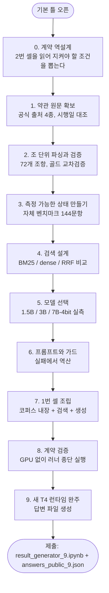

# 결과기 개발 과정

기본 틀을 연 시점부터 제출본이 나오기까지의 실제 경로. 각 단계에서 무엇을 했고 왜 그렇게
했는지, 무엇을 재서 결정했는지를 순서대로 적는다. 수치는 모두 이 저장소의 스크립트로
재현된다.



---

## 0. 먼저 한 일 — 계약을 역설계했다

기본 틀에는 "고정 계약"이 문장으로 적혀 있지만, 실제로 강제하는 주체는 2번 셀 코드다.
그래서 안내문이 아니라 **2번 셀 소스를 직접 읽어** 지켜야 할 조건을 뽑았다.

| 2번 셀이 실제로 검사하는 것 | 어기면 |
|---|---|
| `retrieved` 항목 수 1~4 | ValueError로 그 문항 실패 |
| 문서명을 NFC 정규화 + 공백 제거 후 허용 4종과 대조 | 검색 점수 0 처리 |
| `answer`가 문자열 | TypeError로 문항 실패 |
| 문항당 120초 | 타임아웃 기록 |
| 전역 `app`과 `/health`, `/answer` | 서버 기동 실패로 전량 실패 |

이 단계에서 얻은 게 하나 더 있다. 2번 셀은 문항을 `_SP_QUESTIONS_JSON`으로 자체 보유하고
골드 파일을 읽지 않는다. 즉 결과기는 정답 파일에 의존하지 않아야 하며, 같은 코드가 비공개
30문항에서도 그대로 돌아야 한다는 뜻이다.

## 1. 약관 원문을 어떻게 찾았나

출제 기준일은 2026년 8월 4일인데 약관마다 시행일이 다르다. 배포된 docx만으로는 4종이
채워지지 않아 공식 출처에서 다시 확보했다.

| 약관 | 확보 경로 | 확인한 시행일 | 조 수 |
|---|---|---|---|
| 카카오계정 약관 | `kakao.com/policy/terms?type=a&lang=ko` | 2026-05-29 | 17 |
| 카카오 위치정보 이용약관 | `kakao.com/policy/location?lang=ko` | 2026-07-16 | 16 |
| 카카오 통합서비스약관 | 공식 CDN docx (`.../files/20260529/…docx`) | 2026-05-29 | 18 |
| 카카오 통합 약관 | `kakao.com/policy/kakaoTerms?type=t&lang=ko` | 2022-08-25 (종료 아카이브) | 21 |

찾는 과정에서 두 가지가 걸렸다.

**첫째, 배포본 하나가 틀린 판이었다.** `카카오계정약관20240416.docx`는 2024년 4월 16일
시행본이고, 출제 기준일에 적용되는 것은 2026년 5월 29일 시행본이다. 그대로 썼다면 조문
내용이 어긋난 채로 전체를 만들 뻔했다. 폐기하고 사이트에서 다시 받았다.

**둘째, 문서마다 URL 규칙이 달랐다.** 계정약관은 `/policy/terms?type=a`, 통합 약관은
`/policy/kakaoTerms?type=t`, 위치정보는 `/policy/location`이다. `type=s`는 "카카오
서비스 약관"이라는 다른 문서라 4종에 포함되지 않는다. 각 페이지에서 `시행일자` 문자열을
직접 확인해 어느 것이 어느 약관인지 맞췄다.

통합서비스약관만 HTML 페이지가 없어 공식 CDN의 docx를 받았고, 배포본과 SHA-256이
일치하는 것을 확인해 같은 파일임을 증명했다.

## 2. 가공 — 조 단위로 쪼개고, 쪼갠 결과를 검증했다

`build_corpus.py`가 HTML 3종과 docx 1종을 조(條) 단위로 파싱해 72개 조항을 만든다.
문서마다 마크업이 달라 `제7조(카카오계정 제공)` 형태와 `제 1 조 (목적 및 정의)` 형태를
모두 받는 정규식을 쓴다.

중요한 것은 파싱보다 **검증**이다. 파서는 조용히 틀리기 때문에 세 가지를 assert로 걸었다.

1. 각 원문에 해당 시행일 문자열이 실제로 있는가 → 잘못된 판을 색인하는 사고를 막는다
2. 공개 골드셋의 정답 조항 전건이 파싱 결과에 존재하는가 → **10문항 전건 통과**
3. 정답 핵심 문장이 파싱된 본문에 12자 이상 연속으로 남아 있는가 → **평균 100%**

세 번째가 핵심이다. 채점이 정답 핵심 문장과 답변을 대조하는 방식이므로, 파싱에서 원문
표현이 뭉개지면 그 시점에 이미 점수를 잃는다. 100%는 그 손실이 없다는 뜻이다.

추가로 사이트 내비게이션 잔여물이 본문에 섞였는지, 조 제목이 빠졌는지, 다음 조 본문이
넘어왔는지도 따로 확인했다(각각 0건).

## 3. 측정 가능한 상태부터 만들었다

검색기를 만들고 공개 10문항으로 재 봤더니 **BM25도, dense도, 하이브리드도 전부
recall@4 1.000**이었다. 포화된 세트로는 어떤 개선도 측정되지 않는다. 그래서 개선 작업을
멈추고 측정 도구부터 만들었다.

`make_bench.py`가 72개 조문 전체를 덮는 144문항을 생성한다. 핵심 제약은 **anti-leak**으로,
질문 텍스트가 정답 조항과 10자 이상 연속으로 겹치지 못하게 강제했다. 조항의 희귀 표현을
그대로 베낀 질문은 어휘 일치만으로 풀려 검색기를 구분하지 못하기 때문이다.

- 유형: basic 33 / exact 31 / trap 67 / cross 13
- 72개 조문 전부가 최소 2문항의 정답 조항으로 등장
- 생성 스크립트와 별개로 독립 검증을 한 번 더 실행 — anti-leak 위반 0, 핵심 문장 grounding
  위반 0, 중복 질문 0

## 4. 검색 — 계획을 실측으로 뒤집었다

| 구성 | 공개 10문항 | 합성 144문항 recall@4 | MRR | hit@1 |
|---|---|---|---|---|
| BM25 단독 | 1.000 | 0.644 | 0.450 | 0.312 |
| **dense 단독 (KURE-v1)** | 1.000 | **0.944** | **0.757** | **0.604** |
| RRF (1:1) | 1.000 | 0.808 | 0.639 | 0.514 |
| RRF (dense 가중 8배) | 1.000 | 0.877 | 0.695 | — |

당초 계획은 BM25 + dense 하이브리드였다. 합성 벤치마크가 그 계획을 뒤집었다. **dense
단독이 어떤 융합 가중치보다 낫다.** BM25 후보가 상위 4칸을 잠식해 정답 조항을 밀어낸다.

정직하게 남길 단서는 이 벤치마크가 anti-leak 때문에 구조적으로 BM25에 불리하다는 점이다.
공개 10문항처럼 질문이 약관 어휘를 그대로 쓰면 BM25도 만점이다. 그래서 BM25 구현을 버리지
않고 **임베딩 로드 실패 시의 대체 경로**로 남겼다.

임베딩 모델은 `nlpai-lab/KURE-v1`(BGE-M3 계열 한국어 특화)을 쓴다. 풀링이 CLS인지
config로 확인하고 제출 셀의 구현과 맞췄으며, 절단 길이도 최장 조항 3527자가 잘리지 않게
2048토큰으로 로컬 측정과 제출본을 동일하게 맞췄다. 이 정렬을 하지 않으면 로컬에서 잰
0.944가 제출본에서 재현되지 않는다.

## 5. 모델 선택 — 두 번 재서 결론이 뒤집혔다

먼저 T4 제약이 후보를 좁힌다. sm75라 bfloat16과 FlashAttention-2를 쓸 수 없어 fp16 +
SDPA로 고정했고, vLLM은 설치 과정에서 torch를 교체해 규정 위반이라 transformers를 직접
쓴다. 같은 이유로 sentence-transformers도 쓰지 않고 `AutoModel` + CLS 풀링으로 임베딩을
직접 계산한다.

**1차: 공개 10문항, T4 실측**

| 모델 | 양자화 | hard | p50 | p95 | tok/s | VRAM |
|---|---|---|---|---|---|---|
| Qwen2.5-1.5B-Instruct | fp16 | 0.867 | 5.7s | 12.3s | 23.1 | 5.9GB |
| Qwen2.5-7B-Instruct | 4bit | 0.833 | 7.9s | 23.0s | 9.4 | 10.8GB |
| Qwen2.5-3B-Instruct | fp16 | 0.767 | 5.7s | 15.6s | 14.9 | 9.6GB |

1.5B가 품질·속도·메모리 세 축 모두에서 앞섰다. 크기가 클수록 낫다는 가정과 반대여서
그대로 받아들이지 않고 표본을 늘려 다시 쟀다.

**2차: 자체 48문항, 조건 동일**

| 모델 | soft | exact | trap |
|---|---|---|---|
| **Qwen2.5-3B-Instruct** | **0.498** | **0.644** | **0.420** |
| Qwen2.5-1.5B-Instruct | 0.428 | 0.557 | 0.266 |

**순위가 뒤집혔다.** 1.5B가 무너지는 곳은 trap과 exact, 즉 전제를 바로잡거나 숫자·열거를
정확히 옮겨야 하는 문항이다. 문항 10개에 정답 핵심 문장이 2~5개씩이면 한 문항이 뒤집힐 때
평균이 크게 흔들린다. 표본을 키운 판단이 잘못된 모델 선택을 막았다.

7B 4bit는 크기값을 하지 못했다. 3B보다 품질은 조금 나은데 디코딩이 1.6배 느리고 VRAM은 더
쓰며, 4bit 답변에서 한자가 새어 나왔다("保护의무자는 8세 이하의 아동 등의…"). 채점이 문장
대조인 이상 이런 오염은 그대로 감점이다.

**최종: Qwen2.5-3B-Instruct fp16.** 튜닝을 마친 3B는 같은 T4에서 7B 4bit를 앞선다
(hard 0.850 대 0.833, p95 20.8초 대 23.0초). 모델을 키우는 대신 프롬프트와 가드에 시간을
쓴 쪽이 더 빠르면서 더 정확했다.

## 6. 프롬프트와 가드 — 실패를 세어 만들었다

검색이 만점인 상태에서 답변만 재니 초기 재현율이 0.517이었다. 실패를 유형별로 세어
규칙을 붙였고, 규칙으로 안 되는 것은 코드로 막았다.

**규칙으로 고친 것**

| 관찰된 실패 | 대응 |
|---|---|
| 예/아니오 질문이 아닌데 "아니오"로 시작 | 실제로 예/아니오로 답할 수 있을 때만 사용 |
| 조항 대신 질문 문장을 되풀이 | 질문 되풀이 금지, 부정 전제를 따라 쓰지 말 것 |
| 조항을 요약해 채점 대상 표현이 소실 | 숫자·기간·법령 인용·열거 항목은 원문 그대로 |
| 번호 매기기·글머리 기호 출력 | 이어지는 평서문만 |

**규칙으로 안 되어 코드로 막은 것**

1. **"아니오" 두 글자로 끝내는 축약** — 프롬프트에 금지해도 3B는 지키지 않았다. 답변이
   20자 이하면 그 답변을 씨앗으로 이어 쓰게 재생성한다.
2. **조항 대신 질문을 베끼는 답변** — 답변의 문자 3그램 중 근거 조항에서 온 비율
   (grounding)이 점수를 거의 그대로 예측한다는 것을 발견했다. 0.5 미만 문항의 평균 점수가
   0.087, 이상이 0.605였다. 정답 라벨 없이 추론 시점에 계산되는 값이라 **지표가 아니라
   가드로 썼다.** 0.5 미만이면 인용을 강제해 재생성하고, 다시 잰 비율이 실제로 올라갔을
   때만 교체한다. 가드를 켜자 0.5 미만 답변이 12건에서 3건으로 줄었다.

기여분은 조건을 하나씩 켜 가며 분리했다: 기본 0.475 → 가드 +0.023 → 최종 규칙 +0.045 =
**0.543**. 두 개선이 서로 상쇄하지 않는다.

## 7. 1번 셀 조립

- **코퍼스 내장** — 72개 조항을 gzip + base64로 셀 안에 넣었다(40KB). 규정이 "약관 원문
  저장·색인"을 허용하므로 가능한 방식이고, 실행 중 다운로드에 의존하지 않아 사이트 장애나
  원문 변경에 영향을 받지 않는다. `build_notebook.py`가 `corpus.json`에서 이 문자열을
  매번 다시 생성하므로 코퍼스와 노트북이 어긋날 수 없다.
- **검색** — dense 단독, BM25는 대체 경로로만 잔존
- **생성** — 3B fp16, greedy, max_new_tokens 320, 재생성은 192로 제한해 꼬리 지연을 줄임
- **서버** — 기본 틀의 FastAPI 블록을 그대로 유지

빌드 스크립트가 세 가지를 assert로 고정한다: 코퍼스 blob이 `corpus.json`과 일치할 것,
1번 셀의 답변 규칙이 로컬 측정에 쓴 규칙과 문자열까지 같을 것, 2번 셀이 배포본과
`_SP_TEAM` 한 줄 외에는 동일할 것.

## 8. 계약 검증 — GPU 없이 먼저 끝냈다

맥에는 CUDA가 없지만 **2번 셀 러너를 그대로 로컬에서 실행**했다. 러너 소스는 손대지 않고
출력 경로 한 줄만 임시 디렉터리로 바꿔 exec하고, 디바이스 지정 세 줄만 MPS로 치환해 1번
셀을 실제로 구동했다. 이 단계에서 계약 위반을 전부 제거한 뒤에 Colab을 썼다.

결과: 10문항 응답, 실패 0, 문서명 위반 0, 타임아웃 0, 성능 루프 38요청 전량 성공.

## 9. 새 T4 런타임 완주

새 Colab T4에서 위에서 아래로 한 번 실행했다.

| 항목 | 값 |
|---|---|
| 답변 | 10/10, 실패 0 |
| 허용 밖 문서명 / 타임아웃 | 0건 / 0건 |
| 문항별 소요 | 3.8 ~ 16.0초 |
| p50 / p95 | 11.5초 / 20.8초 |
| 처리량 | 0.144 req/s (동시 2, 12요청 × 3회 전량 성공) |
| 전체 | 333초 |

같은 파일을 다른 사람이 다른 T4에서 다시 돌렸을 때 **답변 문장이 완전히 일치**했다.
greedy 디코딩이라 재현되며, 이는 채점 환경에서 다른 결과가 나올 위험이 없다는 뜻이다.

## 10. 채점식을 알고 나서 한 재검증

뒤늦게 예선 채점식(MRR 20 + 키팩트 F1 30 + LLM 50)이 공개됐다. 그때까지 우리 판정
지표는 **재현율**이었는데 공식은 **F1**이었다. 답변이 길면 정밀도가 깎이는 구조라 방향이
다르다. 그래서 채점식을 로컬에서 근사하고(`official_score.py`, 다른 팀 연습 채점 결과로
토크나이저를 맞춰 오차 0.01 수준) 만들어 둔 판본을 전부 다시 줄세웠다.

결과는 **현행 유지**였다. 다만 재검증에서 새 함정이 드러났다. 조항 선택 단계를 넣고
`retrieved` 순서를 바꾼 판본은 F1이 가장 높았는데도 총점에서 졌다. 순서를 바꾸는 바람에
정답 조항 순위가 밀려 MRR이 0.7882에서 0.7240으로 떨어졌기 때문이다. **MRR 20점이 걸린
검색 순서를 건드리는 개선은 F1 이득을 그대로 상쇄한다.**

공개 10문항 기준 현재 객관 점수는 MRR 20.000/20, 키팩트 F1 20.042/30이다.

---

## 재현 방법

```bash
python3 build_corpus.py          # 약관 파싱 + 검증
python3 make_bench.py --check    # 벤치마크 제약 검증
python3 build_notebook.py        # 제출 노트북 생성
python3 official_score.py answers_public_9.json   # 채점식 근사
python3 rank_official.py         # 판본별 줄세우기
```
